<h1 style="text-align:center; font-size:40px">Marvel Quiz</h1>

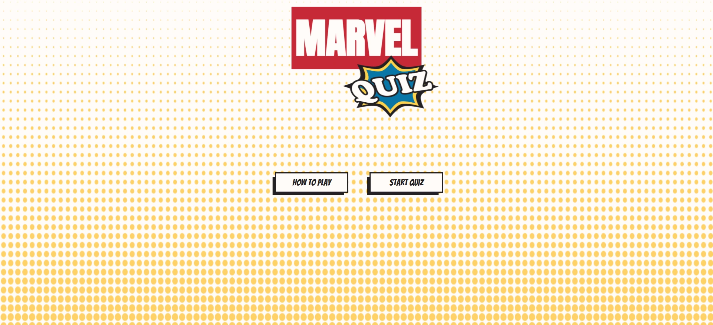

[View the Marvel Quiz live website here](https://abz2489.github.io/marvel-quiz/)

# **UX/UI**

## **Strategy**

### **Project Goals**
- Create a fun, interactive quiz experience for users.
- Provide different levels of difficulty to encourage users to play again.
- Ensure the project is responsive on mobile, tablet and desktop devices.

### **User Goals**
As a user I'm looking to play a fun and challenging quiz game. 

### **User Stories**
- As a user I want to quickly identify what sort of game it is.
- As a user I want to learn how to play easily.
- As a user I want to access the "Start Game" button easily.
- As a user I want to track my score as I play.
- As a user I want to be able to quit the game.
- As a user I want to be alerted when I get the answer right or wrong.
- As a user I want to be able to select a level of difficulty.

## **Scope**

### **Features to include**
- Logo
- "How to Play" pop up with instructions to the user
- Quiz questions chosen at random
- Score counter
- Ability to quit game
- Colour indicator for correct / incorrect answers

### **Future Features**
- Allow user to sign in with username
- Allow user to save their score
- Sound effects for correct / incorrect answers

## **Structure**

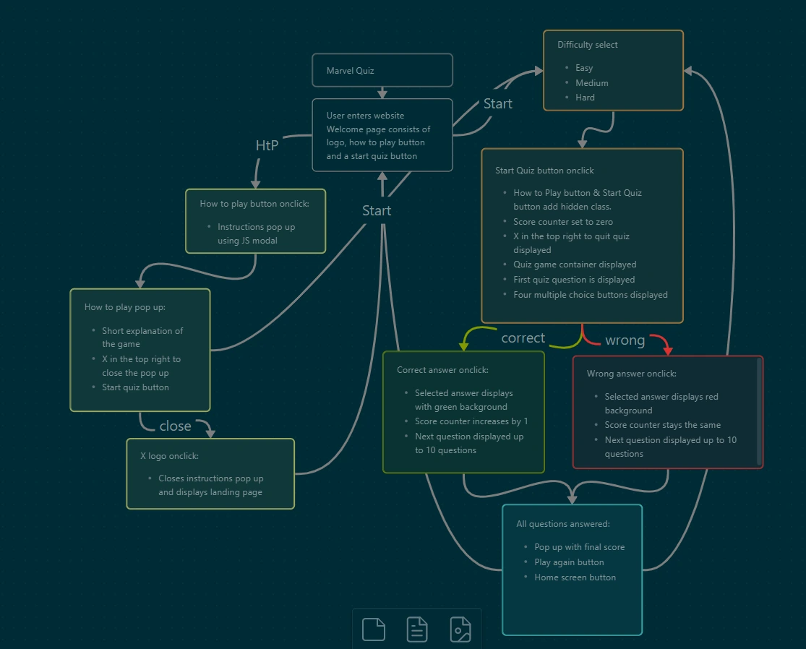 

## **Skeleton**

### **Wireframes**
The project consists of one single page and changes states using JavaScript DOM manipulation and JS modal for any pop ups. 

Mobile

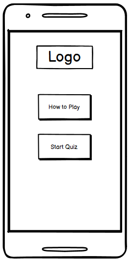
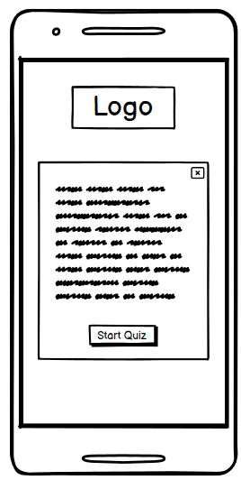
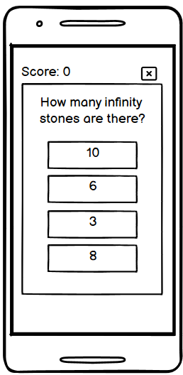

Tablet

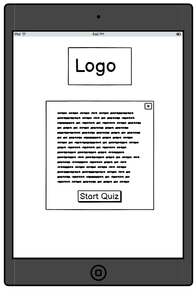

Desktop

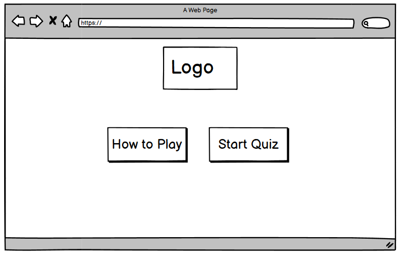

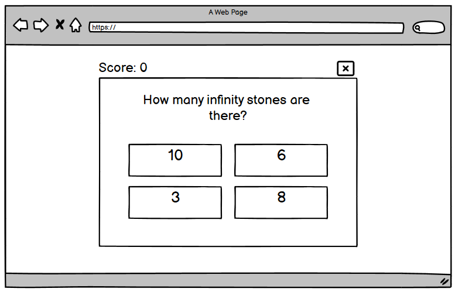

## **Surface**
### **Colour Scheme**

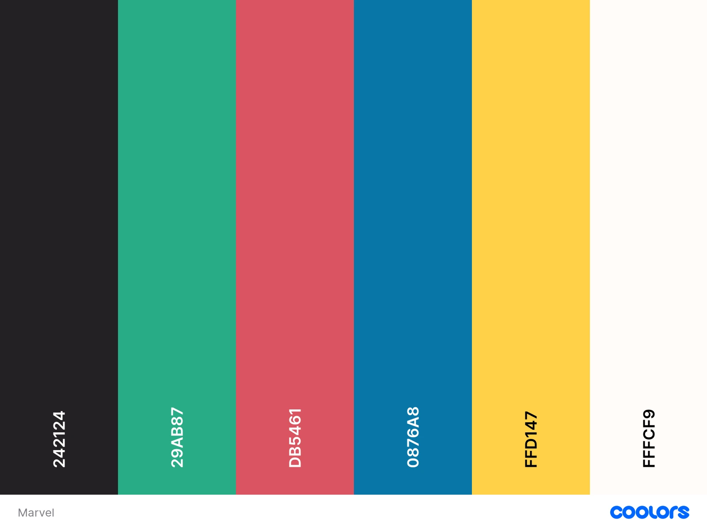 

### **Typography**
All typography for the project has been sourced from [Google Fonts](https://fonts.google.com/).

#### **Marvel Logo**
Anton, Regular 400 -chosen as a similar font to the font used in the Marvel logo.

#### **All other content**
Bangers, Regular 400 - chosen to emulate a comic book feel to the website.

___

# **Features**
Marvel Quiz is a single page website that makes use of multiple containers and the display property to navigate them. As a result, there is no navbar or footer.

Header

The Marvel header was inspired by the usual Marvel logo but using a different font and colour. The quiz header is a custom design, created in Inkscape, designed to replicate a comic style explosion. The quiz logo swings back and fourth twice on initial load.

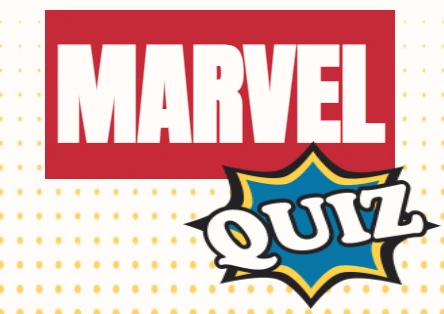

How to Play Modal

Consists of a brief explanation to the user, a quit modal button (top right) and a start quiz button at the bottom.

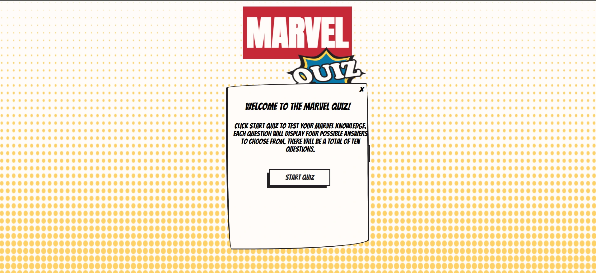

Select Difficulty

The quiz has three sets of questions; easy, medium and hard. This is where the user selects which set they'd like to complete. There is also a quit button in the top right to take users back to the initial load screen.

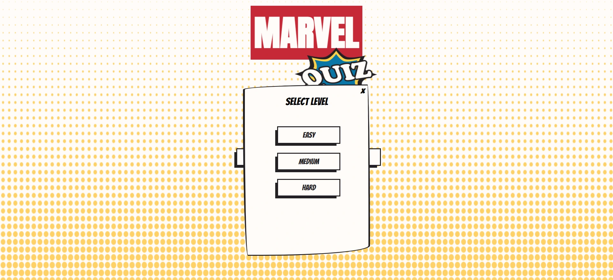

Quiz

The quiz container consists of the user's score, a quit button (top right), quiz question and four multiple choice buttons

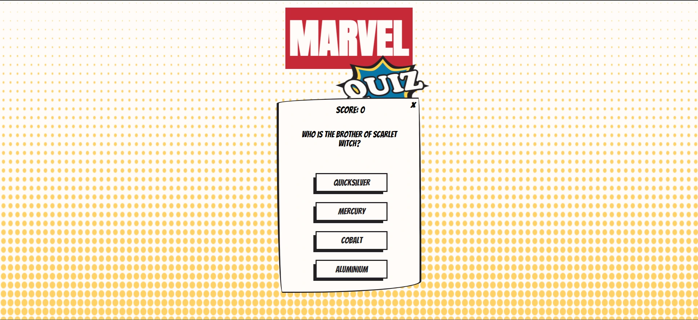

Quit Button

The quit button in all containers that have one rotates 360 degrees when hovered over. As the button is small this will draw the 
user's attention.

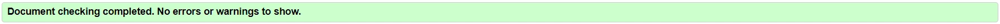

Game Over

The game over container let's the user know that the quiz is over and displays their final score along with a play again button and a home button. The paly again button will display the select difficulty container and the home button takes the user back to the inital load screen.

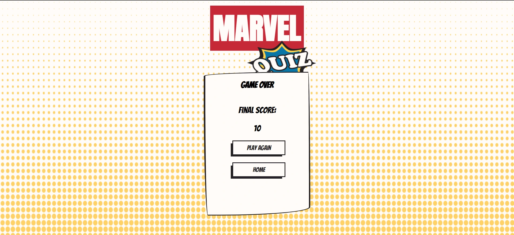

Quit Question

When the user presses the quit button within the quiz the quiz question container will appear. This will alleviate any accidental quitting during the quiz.

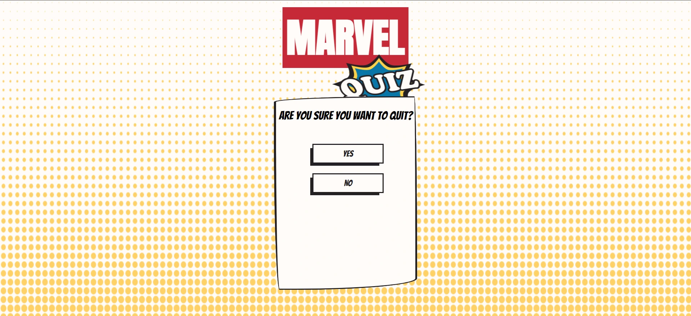

___

# **Technologies Used**

## **Languages**
[HTML5](https://en.wikipedia.org/wiki/HTML5)

[CSS3](https://en.wikipedia.org/wiki/CSS)

[JavaScript](https://en.wikipedia.org/wiki/JavaScript)

## **Frameworks, libraries & programs**
[Git](https://git-scm.com/) used for version control. I used the terminal and git commit/push commands and the source control panel.

[GitHub](https://github.com/) used as storage for the Woofing Walks repository.

[Google Fonts](https://fonts.google.com/) used to import all fonts used on the website.

[Inkscape](https://inkscape.org/) used to create the three background and the quiz logo.

[Coolors](https://coolors.co/) used to build the colour palette.

# **Deployment**
Marvel Quiz live website was deployed using GitHub Pages.

## **Local Deployment**

**How to Fork**
- Go to GitHub repository.
- In the top right of the screen, click the fork button.
- A form will appear, you can edit the name and description or keep it the same.
- Click the green "Create Fork" button.

**How to Clone**
- In the GitHub respository click the green Code button, that sits above the repository files.
- When the dropdown appears choose from HTTP, SSH or GitHub CLI.
- Click the copy button to the right of the URL to copy to your clipboard.
- Open Git Bash / terminal, choose where you want to clone the files.
- Type git clone and the following into the terminal https://github.com/abz2489/marvel-quiz.git
- Press enter to create the clone.

**Remote Deployment**
- Sign in to GitHub or Sign Up for an account.
- Find the woofing-walks repository.
- Click settings.
- Click the Pages link, found on the left hand navigation bar.
- In the Build and Deployment section select the main branch and root folder.
- Click Save, the live website is now deployed.

# **Testing**
All tests can be found at [TESTING.md](TESTING.md).

# **Credits**

## **Content**
The quiz questions are a mixture of ones created by myself and the below links.

[Quiz quesions](https://icebreakerideas.com/marvel-trivia/) used for some of the quiz questions in the game.

[Quiz quesions](https://www.rd.com/article/marvel-trivia/) used for other quiz questions in the game.

## **Media**
[Logos by Nick](https://logosbynick.com/inkscape-comic-book-logo/) was used to create the quiz logo with inkscape. I later used the skills learnt in this tutorial to create the halftone backgrounds.

## **Code**
[Free Code Camp](https://www.freecodecamp.org/news/how-to-build-a-modal-with-javascript/) was used to learn how to create JS modals.

[W3Schools](https://www.w3schools.com/js/js_timing.asp) was used to learn how to set the timeout function for correct and incorrect background changes.

[JavaScript Documentation](https://developer.mozilla.org/en-US/docs/Web/JavaScript) was used throughout development to refresh and explore new solutions.

[CSS Tricks](https://css-tricks.com/almanac/properties/t/transform/) was used to refresh on animations and transformations used for the game.

[A Complete Guide to Flexbox](https://css-tricks.com/snippets/css/a-guide-to-flexbox/) used to refresh on the use of flexbox.

[Comic Style Border](https://codepen.io/mp/pen/kBEeKw) was used to for the border to all containers.

[Comic Style Buttons](https://codemyui.com/comic-book-inspired-dotted-background-text-with-a-dark-shadow-background/) was the source of inspiration and method behind the buttons.

[Hover effects media query](https://medium.com/@mezoistvan/finally-a-css-only-solution-to-hover-on-touchscreens-c498af39c31c) code was used to alter the hover effects to not affect touch screen displays.

## **Acknowledgments**
Cohort facilitator Iris Smok for all her help and support with out cohort.

My mentor Chris Quinn for the words "Make it work, then make it pretty".

My wife for her brilliant Marvel knowledge, not to mention her patience and support.