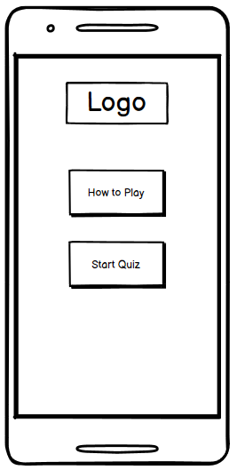
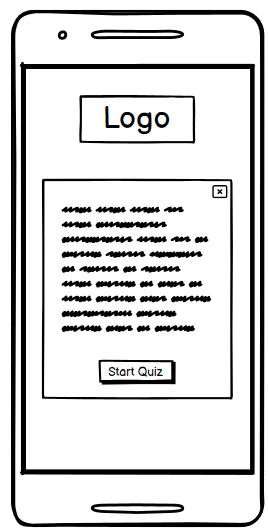
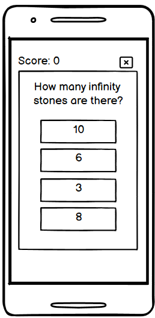
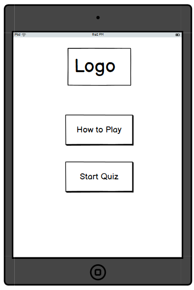
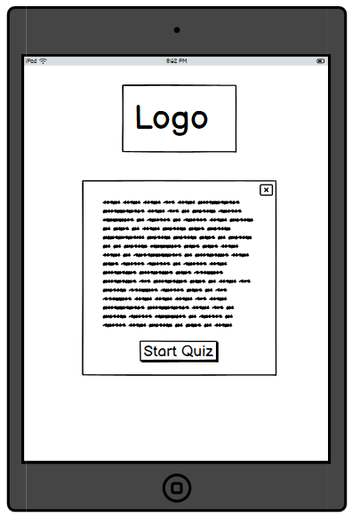
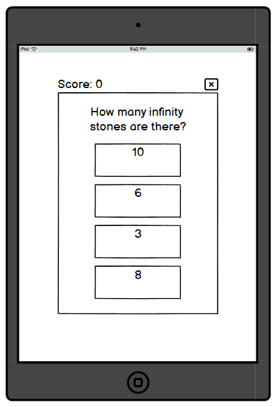
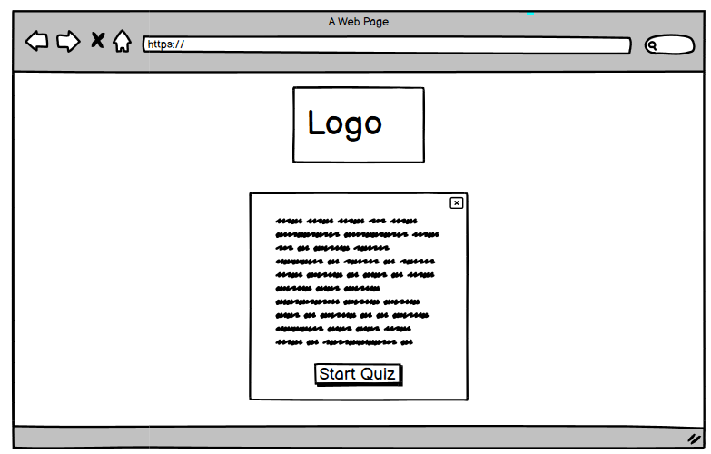
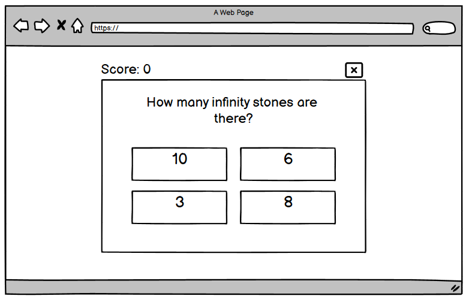

<h1>Marvel Quiz</h1>

# **UX/UI**

## **Strategy**

### **Project Goals**
- Create a fun, interactive quiz experience for users.
- Provide different levels of difficulty to encourage users to play again.
- Ensure the project is responsive on mobile, tablet and desktop devices.

### **User Goals**
As a user I'm looking to play a fun and challenging quiz game. 

### **User Stories**
- As a user I want to quickly identify what sort of game is.
- As a user I want to access the rules of the game easily.
- As a user I want to access the "Start Game" button easily.
- As a user I want to track my score as I play.
- As a user I want to be able to quit the game.
- As a user I want to be alerted when I get the answer right or wrong.

## **Scope**

### **Features to include**
- Logo
- "How to Play" pop up with instructions to the user
- Quiz questions chosen at random
- Score counter
- Ability to quit game
- Colour indicator for correct / incorrect answers

### **Future Features**
- Varying levels of difficulty
- Allow user to sign in with username
- Sound indicator for correct / incorrect answers

## **Structure**

## **Skeleton**

### Wireframes**
The project consists of one single page and changes states using JavaScript DOM manipulation and JS modal for any pop ups. 

Mobile

Tablet

Desktop

## **Surface**

___

# **Features**

___

# **Technologies Used**

## **Languages**

## **Frameworks, libraries & programs**

# **Deployment**
Marvel Quiz live website was deployed using GitHub Pages.

## **Local Deployment**

**How to Fork**
- Go to GitHub repository.
- In the top right of the screen, click the fork button.
- A form will appear, you can edit the name and description or keep it the same.
- Click the green "Create Fork" button.

**How to Clone**
- In the GitHub respository click the green Code button, that sits above the repository files.
- When the dropdown appears choose from HTTP, SSH or GitHub CLI.
- Click the copy button to the right of the URL to copy to your clipboard.
- Open Git Bash / terminal, choose where you want to clone the files.
- Type git clone and the following into the terminal https://github.com/abz2489/marvel-quiz.git
- Press enter to create the clone.

**Remote Deployment**
- Sign in to GitHub or Sign Up for an account.
- Find the woofing-walks repository.
- Click settings.
- Click the Pages link, found on the left hand navigation bar.
- In the Build and Deployment section select the main branch and root folder.
- Click Save, the live website is now deployed.

# **Credits**

## **Content**

## **Media**

## **Code**

## **Acknowledgments**