<h1>Marvel Quiz - Testing</h1>

# **Bugs & Fixes**
1. Modal obstructs quiz container when start quiz button within how to play modal is clicked. Fixed by adding hidden class to the modal within the loadQuiz function.

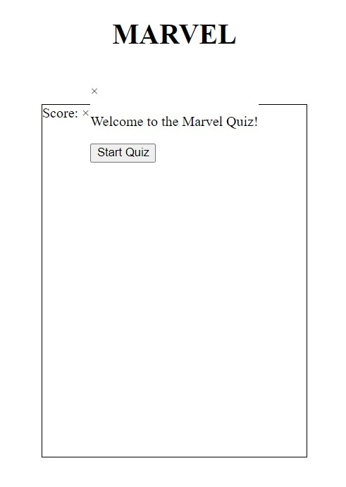

2. Previous question choices remain on screen when next question and answers have loaded. Fixed by adding a while loop to choicesContainer.firstChild. The loop removes all first children from choices container.

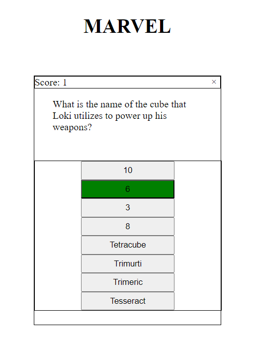

3. Game Over function doesn't execute when currentQuestionIndex is greater than or equal to questions.length. Fixed using dev tools and setting breakpoints to walk through the displayQuestion function. questionContent.innerHTML was sitting above the if statement causing the function to attempt to load question.

4. Quiz container closes when x button is pressed but the game doesn't reset. When start quiz is pressed choices multiply. Fixed by calling the clearChoices function when yes button is clicked within the quit quiz modal.

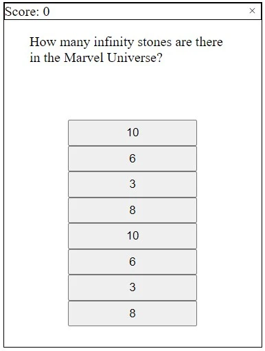

5. Final score isn't showing when Game Over function is called. Fixed, final-score class was missing from the relevant p element.

6. Btn and btn-close hover effects won't function as intended on touch screen devices. Fixed by adding hover effects to media queries specifying devices with hover capabilities.

7. Moving the nextQuestion function to its own function caused a bug that would cause the questions to skip through to the end after just one answered question. This was becuase I misplaces the set timeout method. Bug fixed by moving nextQuesiton function below the checkAnswer function and placing the timeout at the end of the checkAnswer function.

8. Background cuts on screens over 1000px in height. Fixed by increasing height to 1200px.

# **Unfixed Bugs**
1. Select difficulty container positioning isn't consistent with all other containers despite having the same container class. To avoid the container sitting too far down a position of absolute has been added along with top 53%.

# **Validation Testing**

## **HTML Validation**

## **CSS Validation**

## **JavaScript Validation**

## **Lighthouse Testing**

___

# **Manual Testing**

## **User Stories Testing**

|**User Need**|**Achieved?**|
|---|---|
|As a user I want to quickly identify what sort of game it is.| The page logo displays on initial load and is clear to the user.
|As a user I want to learn how to play easily.| On initial load the "How to Play" button is displayed clearly in the center.
|As a user I want to access the "Start Quiz" button easily.| On initial load the "Start Quiz" button is displayed clearly in the center. There is also a "Start Quiz" button within the How to Play modal.
|As a user I want to be able to select different levels of difficulty.| When "Start Quiz" is pressed the user is prompted to select a level of difficulty.
|As a user I want to track my score as I play.| With each correct answer the score counter increases by one point and displays at the top of the quiz container. The final score is displayed in the game over container at the end of the quiz.
|As a user I want to be able to quit the game.| The game has a clear X in the top right corner of the container that will rotate when hovered. When pressed the user is prompted with the "Are you sure you want to quit?" container to avoid accidental quitting.
|As a user I want to be alerted when I get the answer right or wrong.| When the user answers correctly the backround changes to green. When the user answers incorrectly the background changes to red.

## **Responsiveness**
Responsive testing was completed on the following devices through Chrome dev tools. Samsung ZFlip 3 was tested live on the device using both the Chrome browser and the Samsung browser.

**Mobile:**
- iPhone 6/7/8

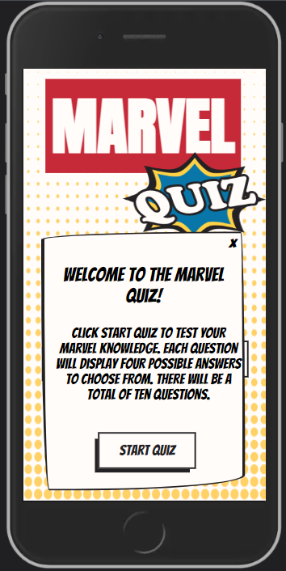
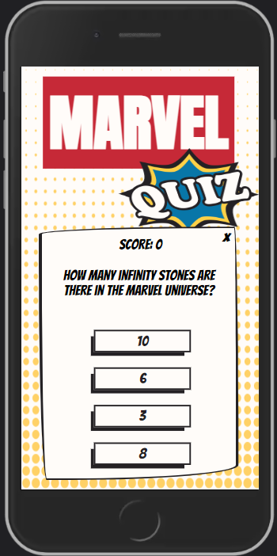
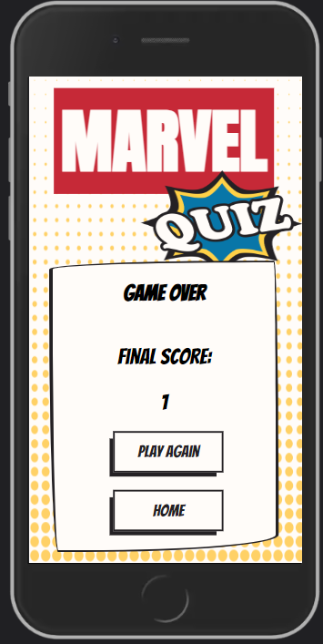

- iPhone X

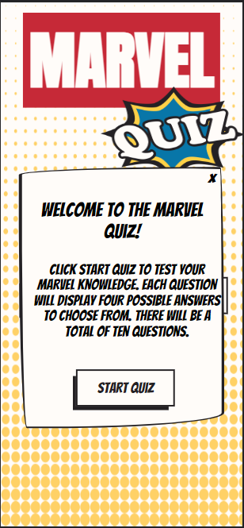
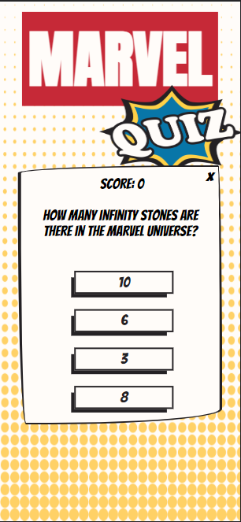
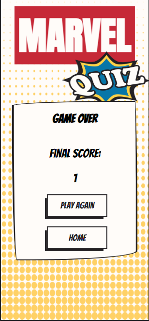

- Samsung ZFlip 3
    - Chrome Browser

        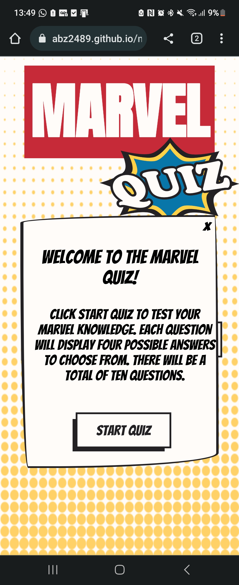
        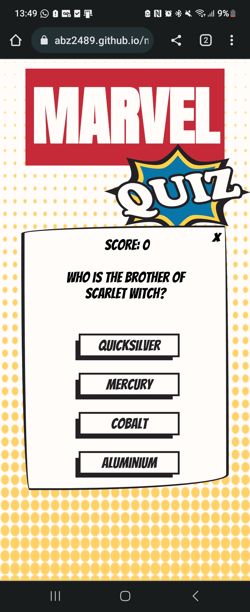
        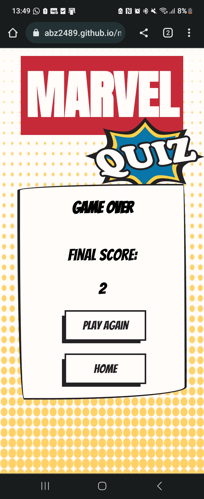

    - Samsung Browser

        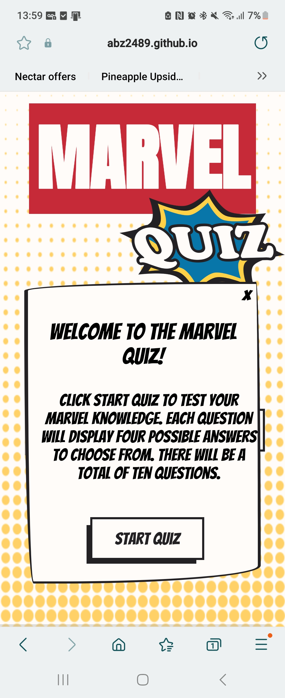
        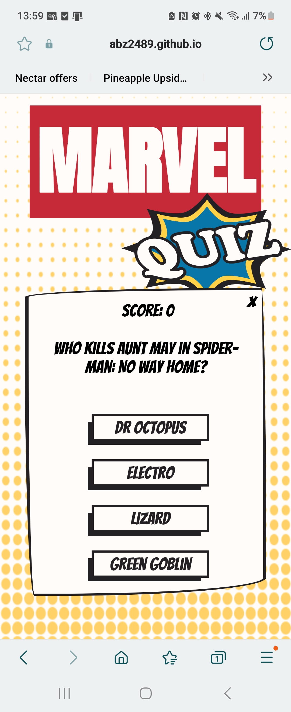
        

**Tablet**
- iPad Mini

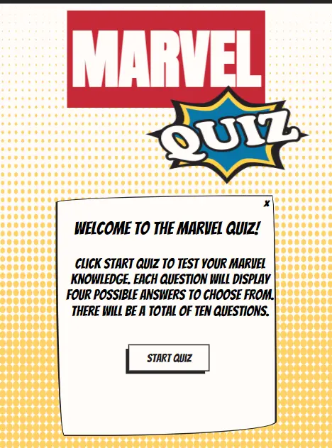
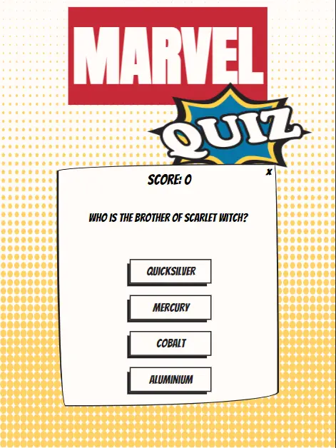
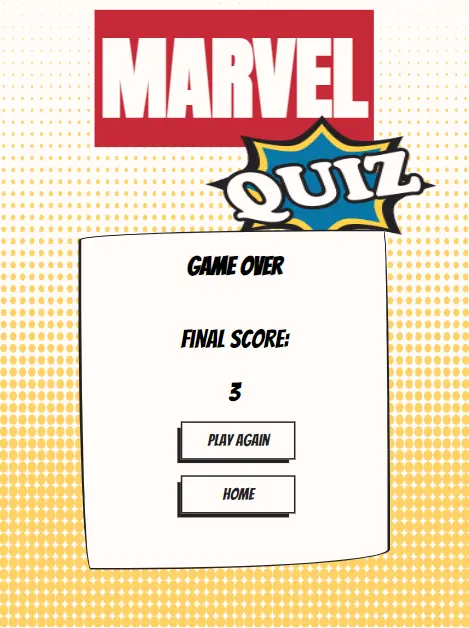  
  
- iPad Air

**Desktop**
- 1024px
- 1440px

## **Feature Testing**

### **Homepage**
|**Feature**|**Expected Result**|**How to Test**|**Result**|**Pass/Fail**|
|---|---|---|---|---|
|The Title Logo|Quiz logo swings back and forth twice on initial load|Refresh the page to test|
|How to play button|Opens the how to play modal|
|Start Quiz button|Displays the select difficulty container|
|All buttons in the game display white with black text until hovered, the text will display white and the background will be black|Hover over buttons|

### **How to Play Modal**
|**Feature**|**Expected Result**|**How to Test**|**Result**|**Pass/Fail**|
|---|---|---|---|---|
|X in top right corner|Closes the modal|Click the X|
|X in top right corner|Rotates|Hover over the X|
|Start Quiz button|Displays the select difficulty container|
|All buttons in the game display white with black text until hovered, the text will display white and the background will be black|Hover over buttons|

### **Select Difficulty Container**
|**Feature**|**Expected Result**|**How to Test**|**Result**|**Pass/Fail**|
|---|---|---|---|---|
|Easy button|Takes user to the first question of the quiz using the easy questions|Click Easy button
|Medium button|Takes user to the first question of the quiz using the medium questions|Click Medium button
|Hard button|Takes user to the first question of the quiz using the hard questions|Click Hard button
|All buttons in the game display white with black text until hovered, the text will display white and the background will be black|Hover over buttons|

### **Quiz Container**
|**Feature**|**Expected Result**|**How to Test**|**Result**|**Pass/Fail**|
|---|---|---|---|---|
|Score Counter|Increases the score by one for each correct answer only|Select correct answer first then select incorrect answer to make sure the score doesn't increase|
|X in top right corner|Displays quit quiz modal|Click the X|
|X in top right corner|Rotates|Hover over the X|
|Quiz Question|Will load the next question after an answer is chosen and the checkAnswer function has executed. If there are no more questions the Game Over container displays.|console.log question content to make sure the question is populating.
|Choices buttons|The displayQuestion function executes a loop that populates the choices based on the current question index|console.log button should log four buttons|
|Correct Answer|The correct answer has a dataset of true|Console.log button will show the correct answer with a dataset of true|
|Incorrect Answers|Have no dataset added|Console.log button should show the three incorrect answers have no dataset|
|Correct Answer selected|Background changes to green, score increments and next question displays with choices|Click correct answer|
|Incorrect Answer selected|Background changes to red, no score increase and next question displays with choices|Click incorrect answer|
|All buttons in the game display white with black text until hovered, the text will display white and the background will be black|Hover over buttons|

### **Quit Quiz Modal**
|**Feature**|**Expected Result**|**How to Test**|**Result**|**Pass/Fail**|
|---|---|---|---|---|
|Quit question|Displays each time the quit button is pressed to ask the user if they're sure. This avoids accidental quitting|Click X to quit quiz|
|Yes button|Quits the quiz and takes the user back to the start displaying how to play and start quiz buttons|Click yes button|
|No button|Closes the quit quiz modal and returns to the game where the user left off|Click no button|
|All buttons in the game display white with black text until hovered, the text will display white and the background will be black|Hover over buttons|

### **Game Over**
|**Feature**|**Expected Result**|**Test Performed**|**Result**|**Pass/Fail**|
|---|---|---|---|---|
|Final Score|Displays final score|Console.log score to make sure the final score is the same|
|Play Again button|Displays select difficulty container|Click Play Again button|
|Home button|Closes the game over container and takes the user back to the start displaying how to play and start quiz buttons|Click Home button|
