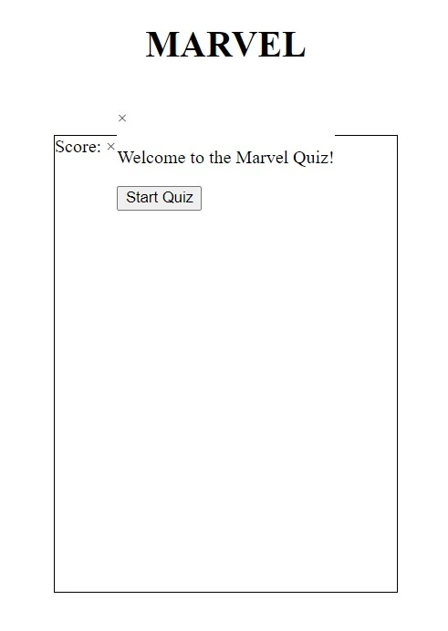
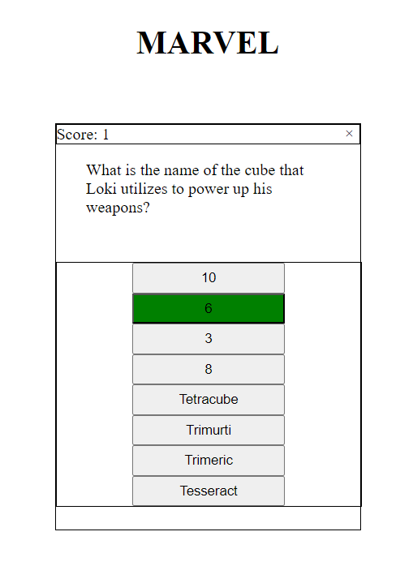
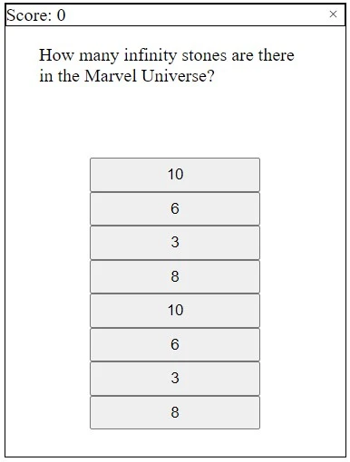

<h1>Marvel Quiz - Testing</h1>

# **Bugs & Fixes**
1. Modal obstructs quiz container when start quiz button within how to play modal is clicked. Fixed by adding hidden class to the modal within the loadQuiz function.

2. Previous question choices remain on screen when next question and answers have loaded. Fixed by adding a while loop to choicesContainer.firstChild. The loop removes all first children from choices container.

3. Game Over function doesn't execute when currentQuestionIndex is greater than or equal to questions.length. Fixed using dev tools and setting breakpoints to walk through the displayQuestion function. questionContent.innerHTML was sitting above the if statement causing the function to attempt to load question.

4. Quiz container closes when x button is pressed but the game doesn't reset. When start quiz is pressed choices multiply. Fixed by calling the clearChoices function when yes button is clicked within the quit quiz modal.

5. Final score isn't showing when Game Over function is called. Fixed, final-score class was missing from the relevant p element.

6. Btn and btn-close hover effects won't function as intended on touch screen devices. Fixed by adding hover effects to media queries specifying devices with hover capabilities.

7. Moving the nextQuestion function to its own function caused a bug that would cause the questions to skip through to the end after just one answered question. This was becuase I misplaces the set timeout method. Bug fixed by moving nextQuesiton function below the checkAnswer function and placing the timeout at the end of the checkAnswer function.

# **Automated Testing**

## **HTML Validation**

## **CSS Validation**

## **JavaScript Validation**

## **Lighthouse Testing**

___

# **Manual Testing**

## **User Stories Testing**

|**User Need**|**Achieved?**|
|---|---|
|As a user I want to quickly identify what sort of game it is.| The page logo displays on initial load and is clear to the user.
|As a user I want to learn how to play easily.| On initial load the "How to Play" button is displayed clearly in the center.
|As a user I want to access the "Start Quiz" button easily.| On initial load the "Start Quiz" button is displayed clearly in the center. There is also a "Start Quiz" buttpn within the How to Play modal.
|As a user I want to be able to select different levels of difficulty.| When "Start Quiz" is pressed the user is prompted to select a level of difficulty.
|As a user I want to track my score as I play.| With each correct answer the score counter increases by one point and displays at the top of the quiz container.
|As a user I want to be able to quit the game.| The game has a clear X in the top right corner of the container that will rotate when hovered. When pressed the user is prompted with the "Are you sure you want to quit?" container to avoid accidental quitting.
|As a user I want to be alerted when I get the answer right or wrong.| When the user answers correctly the backround changes to green. When the user answers incorrectly the background changes to red.

## **Feature Testing**

### **Homepage**
|**Feature**|**Expected Result**|**Test Performed**|**Result**|**Pass/Fail**|
|---|---|---|---|---|

### **How to Play Modal**
|**Feature**|**Expected Result**|**Test Performed**|**Result**|**Pass/Fail**|
|---|---|---|---|---|

### **Select Difficulty Container**
|**Feature**|**Expected Result**|**Test Performed**|**Result**|**Pass/Fail**|
|---|---|---|---|---|

### **Quiz Container**
|**Feature**|**Expected Result**|**Test Performed**|**Result**|**Pass/Fail**|
|---|---|---|---|---|

### **Quit Quiz**
|**Feature**|**Expected Result**|**Test Performed**|**Result**|**Pass/Fail**|
|---|---|---|---|---|

### **Game Over**
|**Feature**|**Expected Result**|**Test Performed**|**Result**|**Pass/Fail**|
|---|---|---|---|---|
